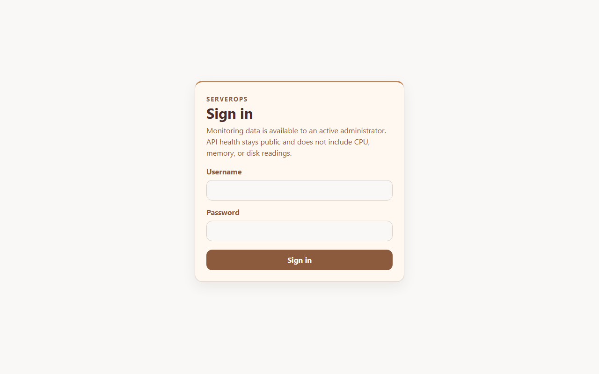
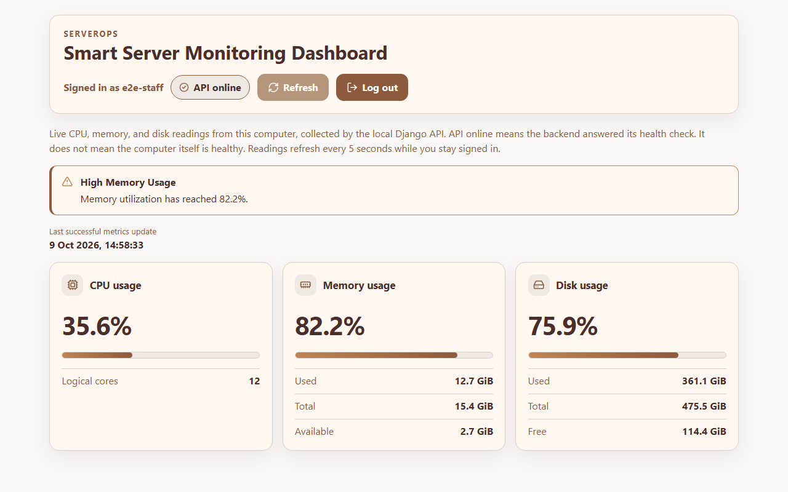
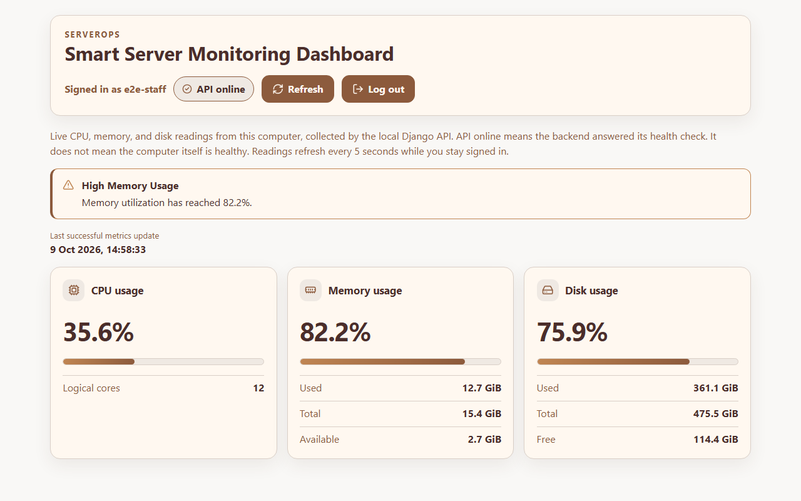
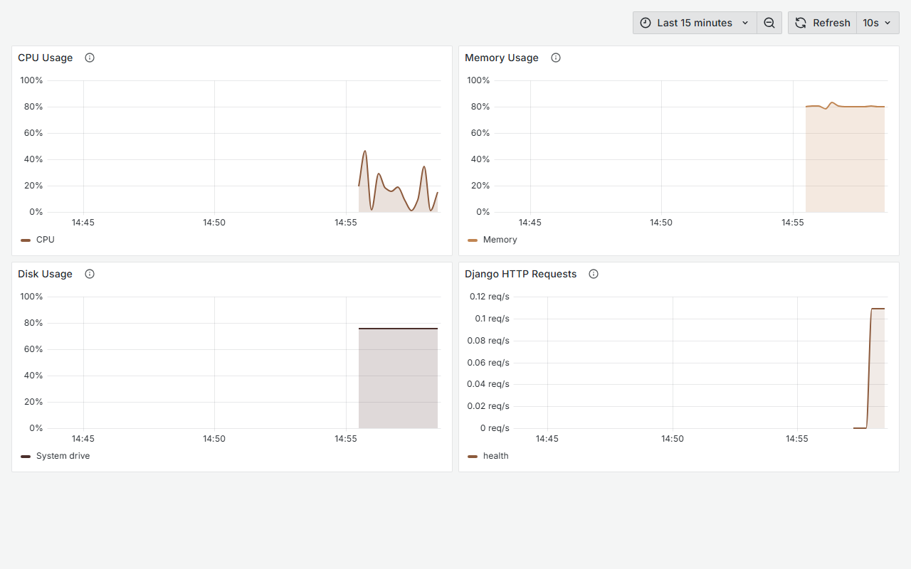

# ServerOps – Smart Server Monitoring & Automation Dashboard

ServerOps is a local monitoring project for one Windows PC. It shows live CPU, memory, and disk usage in a React dashboard, stores the same readings in Prometheus, charts them in Grafana, and demonstrates Linux configuration with Ansible inside a disposable container.

The dashboard is for an active staff user. Health stays public and does not include resource numbers. Nothing in this repository is a public or production deployment.

## Overview

- Real-time CPU, memory, and system-drive readings from this PC
- Staff login, session persistence, and logout
- Resource alerts at 80% CPU or memory
- Prometheus scrape and a four-panel Grafana dashboard
- An isolated Ansible lab that writes configuration and a health-check script
- Pytest and Playwright suites that use disposable databases

## Key features

- `GET /api/health/` is public and returns only a service status
- CPU, memory, disk, and combined metrics require an active staff session
- The dashboard signs in, keeps the session across reload, and signs out
- Signed-in readings refresh about 5 seconds after the previous response
- Refresh requests a new snapshot without reloading the page
- CPU and memory alerts appear at or above 80% and clear below that line
- Stale readings stay visible and labeled when a later request fails
- `GET /internal/metrics/` exposes Prometheus text and requires a bearer token
- Grafana charts CPU, memory, disk, and Django HTTP request rate
- Ansible configures only `/tmp/serverops-lab` inside its own container

## Screenshots

The frames below are from the running Coffee & Cream interface. The signed-in user is the disposable test account `e2e-staff`. Percentages are live readings from this PC, including a memory alert above 80%. No password is shown.









## Design system

The dashboard uses eight colors, defined as CSS custom properties in `frontend/src/styles.css`.

| Token | Hex | Use |
| --- | --- | --- |
| Warm cream | `#FFF8F0` | Header, cards, and button text |
| Caramel | `#C08552` | Accents, alert borders, and progress fills |
| Coffee brown | `#8C5A3C` | Secondary text, icons, and primary buttons |
| Deep espresso | `#4B2E2B` | Primary text, headings, and button hover |
| Soft off-white | `#F9F8F6` | Page background |
| Warm gray | `#EFE9E3` | Muted surfaces and progress tracks |
| Subtle border | `#D9CFC7` | Card, input, and header borders |
| Muted sand | `#C9B59C` | Disabled controls, with espresso text |

Caramel and sand are not used for small text. Focus uses an espresso outline plus a caramel ring. Statuses also use icons and words, not color alone. Grafana chart lines use coffee, caramel, and espresso. Grafana's own chrome stays on Grafana's light theme and is not restyled.

## Technology stack

| Area | Technologies |
| --- | --- |
| Backend | Python 3.11, Django 5.2, Django REST Framework, psutil, SQLite |
| Frontend | React 19, TypeScript, HTML, CSS, Vite |
| Monitoring | Prometheus 2.55.1, Grafana 11.5.2, prometheus-client, Docker Compose |
| Automation | Ansible Core 2.18, Docker |
| Testing | Pytest, pytest-django, pytest-cov, Playwright, Chromium |
| Development | Git, Windows PowerShell |

Backend packages live in `backend/.venv`. Frontend packages live in `frontend/node_modules`. Ansible is not installed on Windows.

## Architecture

```text
Windows host
    -> psutil
    -> Django REST API on 127.0.0.1:8000
    -> React dashboard on 127.0.0.1:5173
```

Monitoring:

```text
Django GET /internal/metrics/
    -> Prometheus
    -> Grafana
```

Automation:

```text
Docker Linux lab
    -> Ansible playbook (local connection)
    -> configuration file and health-check script
```

Django stays on Windows so the metrics describe this PC. Vite proxies `/api` to Django, so the session cookie stays on the dashboard origin. Prometheus reaches Django through `host.docker.internal`. The Ansible lab does not configure Windows and does not deploy Prometheus or Grafana.

Details are in [docs/ARCHITECTURE.md](docs/ARCHITECTURE.md). The phase record is in [docs/ROADMAP.md](docs/ROADMAP.md).

## Installation

Install Python 3.11, Node.js, and Docker Desktop. On this machine the default `python` command is newer than 3.11, so backend commands use `py -3.11` or the virtualenv interpreter.

The project path contains spaces, an ampersand, and an en dash. Quote it.

```powershell
Set-Location -LiteralPath "C:\Users\om\Documents\coding\My Notebook\Side projects\ServerOps – Smart Server Monitoring & Automation Dashboard"
```

## Backend setup

```powershell
Set-Location -LiteralPath "...\backend"
py -3.11 -m venv .venv
.\.venv\Scripts\python.exe -m pip install -r requirements.txt
copy ..\.env.example .env
```

Edit `backend/.env`. Replace `DJANGO_SECRET_KEY` and `SERVEROPS_METRICS_TOKEN` with long random strings. Leave `DJANGO_DEBUG=True` only on this computer. Do not commit `.env`.

Copy the same scrape token into `monitoring/prometheus/secrets/scrape_token`. The example text is in `monitoring/prometheus/scrape_token.example`. The `secrets` directory is gitignored.

```powershell
.\.venv\Scripts\python.exe manage.py migrate
.\.venv\Scripts\python.exe manage.py createsuperuser
.\.venv\Scripts\python.exe manage.py runserver 127.0.0.1:8000
```

The API is http://127.0.0.1:8000/api/health/ . Create the superuser yourself. Automated tests do not use that account.

## Frontend setup

```powershell
Set-Location -LiteralPath "...\frontend"
npm install
npm run dev
```

Open http://127.0.0.1:5173/ . Leave `VITE_API_BASE_URL` empty, as in `frontend/.env.example`, so the browser uses the Vite proxy.

## Monitoring setup

Start Docker Desktop, then start Django on `127.0.0.1:8000`.

```powershell
copy monitoring\grafana\.env.example monitoring\grafana\.env
```

Set `GF_SECURITY_ADMIN_PASSWORD` in `monitoring/grafana/.env` to a random password. Do not commit that file.

```powershell
docker compose up -d
```

- Prometheus: http://127.0.0.1:9090
- Grafana: http://127.0.0.1:3000
- Dashboard: ServerOps — System Performance Monitoring

Prometheus scrapes `host.docker.internal:8000/internal/metrics/` with the bearer token. Grafana queries Prometheus at `http://prometheus:9090`. Signup and anonymous access are off.

Stop the containers without deleting their data:

```powershell
docker compose down
```

## Ansible automation

The lab is separate from the monitoring Compose file. Commands and troubleshooting are in [automation/ansible/README.md](automation/ansible/README.md).

```powershell
Set-Location -LiteralPath "...\automation\ansible"
docker compose -f compose.yml up -d --build
docker compose -f compose.yml exec -T lab ansible-playbook playbook.yml
docker compose -f compose.yml exec -T lab ansible-playbook playbook.yml
docker compose -f compose.yml down
```

The second run on the same container should report `changed=0`. The health check is `/tmp/serverops-lab/scripts/health_check.py` inside the container. It inspects the container, not Windows.

## Automated testing

Test commands, the disposable databases, and the generated `e2e-staff` account are documented in [tests/README.md](tests/README.md).

From `backend/`:

```powershell
.\.venv\Scripts\python.exe -m pip install -r requirements-dev.txt
.\.venv\Scripts\python.exe manage.py test monitor
.\.venv\Scripts\python.exe -m pytest
```

From `frontend/`:

```powershell
npm install
$env:PLAYWRIGHT_BROWSERS_PATH = ".\.playwright-browsers"
node ./node_modules/@playwright/test/cli.js install chromium
npm run test:e2e
```

Pytest uses `backend/.test-runtime/pytest.sqlite3`. Playwright starts Django on `127.0.0.1:8016` with `backend/.test-runtime/e2e.sqlite3`. Neither suite opens `backend/db.sqlite3`.

## Security

- Metrics require an active staff session. Anonymous calls receive 401. Non-staff users receive 403.
- Login and logout require a CSRF token. Failed checks return a short JSON message.
- The Prometheus endpoint compares the bearer token with a digest and fails closed when the token is missing.
- CORS allows only the local Vite origins and does not allow credentialed cross-origin calls.
- Django and the dashboard bind to `127.0.0.1`. Grafana anonymous access and signup are off.
- Secrets belong in gitignored `.env` files and `monitoring/prometheus/secrets/`. Examples contain placeholders only.

These are local development controls. Debug mode, SQLite, and localhost binding are not a production deployment.

## Limitations

- The app monitors the Windows PC where Django is running.
- Disk metrics use the Windows system drive.
- Alert thresholds are fixed at 80% in the React app.
- Ansible configures one disposable container. It does not use SSH and does not change Windows.
- Prometheus and the Ansible lab need Docker Desktop.
- There is no cloud deployment, CI pipeline, or public signup.

## Project status

Phases 0 through 7 were verified on this machine on 9 October 2026.

- Django checks: no issues. Migrations: no pending changes.
- Django tests: 38 passed. Pytest: 38 passed, 91% coverage of `monitor` and `config`.
- Playwright: 23 passed in Chromium.
- Frontend lint and production build passed.
- Prometheus target `serverops` was up, and Grafana showed the four panels.
- Ansible second run reported `changed=0`.

The local Git repository has no commits and no remote. Publishing to GitHub is a separate step and has not been done.

## Project layout

```text
backend/                  Django API, tests, and the local virtualenv
frontend/                 React dashboard and Playwright tests
monitoring/prometheus/    Scrape config. The token file is gitignored.
monitoring/grafana/       Datasource, dashboard, and a gitignored admin env file
automation/ansible/       Disposable Ansible lab
docs/                     Architecture, roadmap, and screenshots
tests/README.md           How to run the suites
docker-compose.yml        Prometheus and Grafana
```
